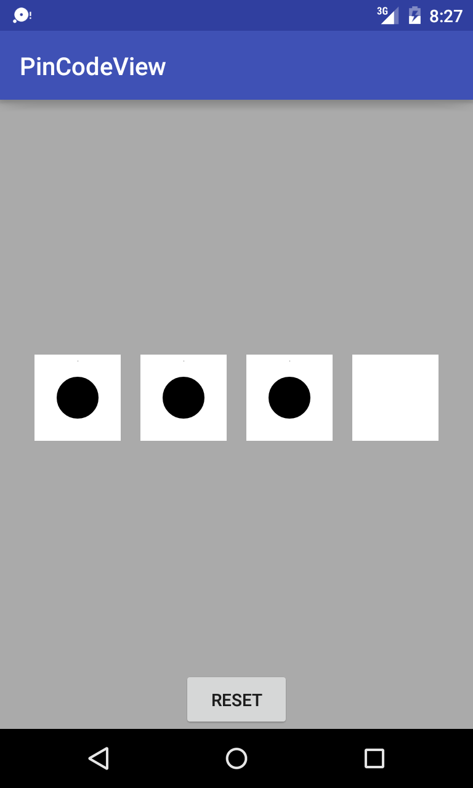
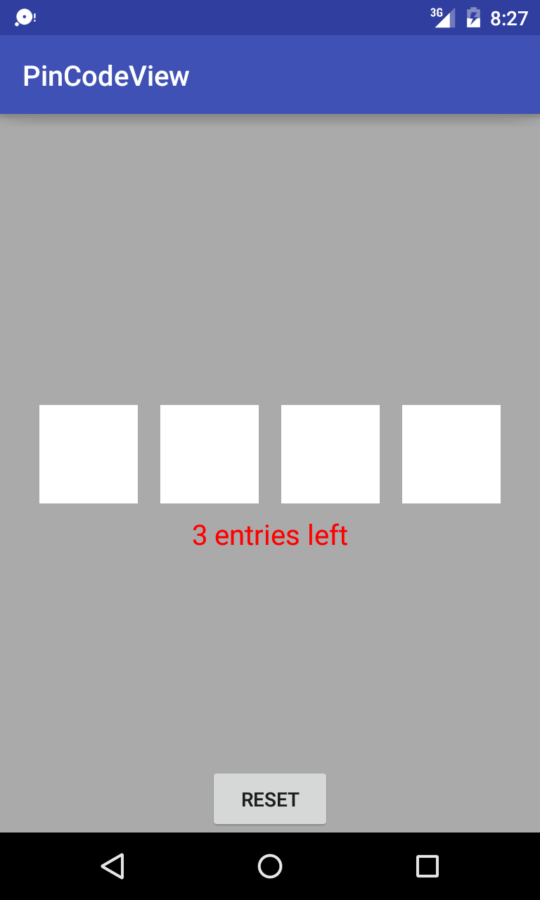
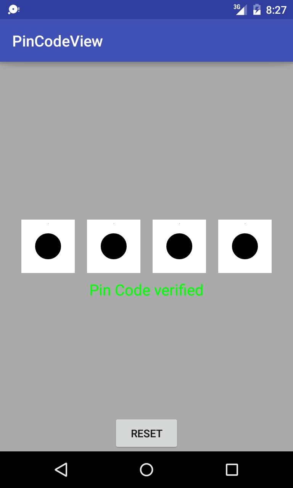

# pin-code-view
Android view that provides pin code functionality

## Screenshots:




## How to use:
* Import the project into your project or just copy the view class. It is located in the [```com.mostcho.pincodeview.ui.views.PinCodeView```](https://github.com/sspasov/pin-code-view/blob/master/app/src/main/java/com/mostcho/pincodeview/ui/views/PinCodeView.java)

* Your layout should look like 
```xml
<RelativeLayout
    xmlns:android="http://schemas.android.com/apk/res/android"
    xmlns:tools="http://schemas.android.com/tools"
    android:layout_width="match_parent"
    android:layout_height="match_parent"
    android:background="@android:color/darker_gray">

    <com.mostcho.pincodeview.ui.views.PinCodeView
        android:id="@+id/pin_view"
        android:layout_width="match_parent"
        android:layout_height="wrap_content"
        android:layout_centerInParent="true"/>

</RelativeLayout>
```
* In your class you must find the view, set its pin modes and implement the completion listener
```java
public class MainActivity extends AppCompatActivity implements PinCodeView.IPinCodeViewListener {

    private PinCodeView pinCodeView;

    @Override
    protected void onCreate(Bundle savedInstanceState) {
        super.onCreate(savedInstanceState);
        setContentView(R.layout.activity_main);

        /**
         * find view and add the completion listener
         * */
        pinCodeView = (PinCodeView) findViewById(R.id.pin_view);
        pinCodeView.setCompletionListener(this);

        /**
         * set PinCodeMode to SET_NEW_PINCODE in order to create the new pin code,
         * your responsibility is how you handle the new pin code after entering it
         * */
        pinCodeView.setPinCodeMode(PinCodeView.PinCodeMode.SET_NEW_PINCODE);
    }
    
    @Override
    public void onNewPinCode(String pinCode) {
        /**
         * once the new pin code is entered you must handle it here (probably save it) after that
         * you can go into the other mode VERIFY_PINCODE. If you don't pass pin code to verify with
         * it will use the default "0000".
         * */
    }

    @Override
    public void onCorrectPinCode(boolean isPinCodeCorrect) {
        if (isPinCodeCorrect) {
            /**
             * entered pin code is correct. DO something here.
             * */
        } else {
            /**
             * entered pin code is INCORRECT. DO something here.
             * */
        }
    }
}
```
## More about the pin modes:
* SET_NEW_PINCODE - when you use this mode the view fetches the first entered 4 numbers combination and passes the result in ```public void onNewPinCode(String pinCode)```. There you can do whatever you want with it. 
* VERIFY_PINCODE - when you use this mode the view verifies fetched pin code with the default provided one. You can provide default pin code by calling the method ```pinCodeView.setDefaultPinCode(String defaultPinCode);```
